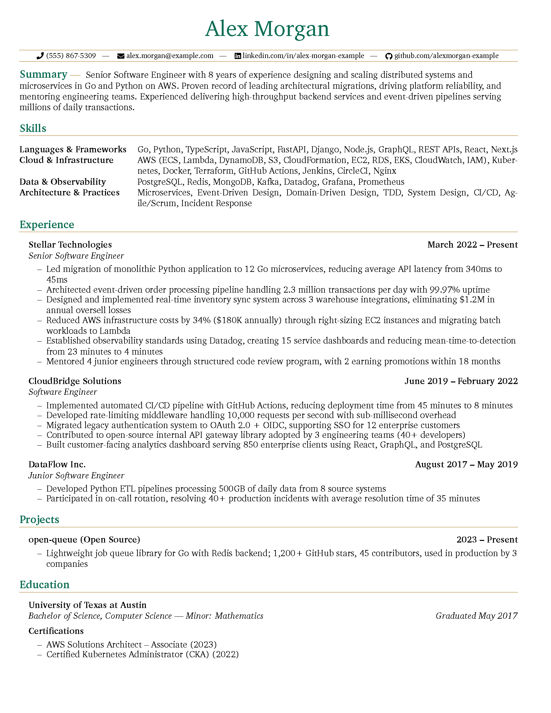
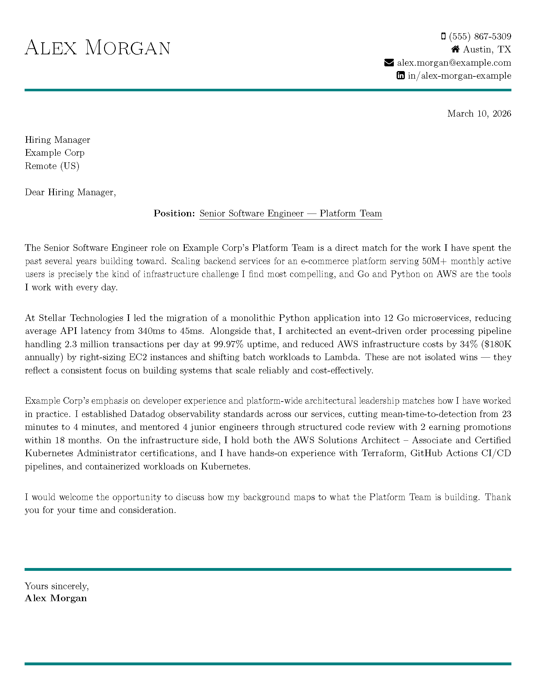

# ATS Resume Writer Agent for Claude Code

> v1.0.0

An AI-powered resume and cover letter generator that uses [Claude Code](https://docs.anthropic.com/en/docs/claude-code) to create ATS-optimized, LaTeX-formatted resumes tailored to specific job descriptions.

**Zero fabrication policy:** The agent will never estimate metrics, suggest proxy numbers, or embellish your experience. If a quantified achievement isn't in your master document, it won't appear in the output. This is a hard constraint, not a suggestion.

## How It Works

1. You maintain a **Master Career Document** (a single Markdown file containing your complete career history)
2. You drop a **job description** file into the project
3. You tell Claude to generate a resume in the Claude Code terminal
4. The agent analyzes the job description, selects the most relevant content from your career document, and produces a polished LaTeX resume optimized for Applicant Tracking Systems

### Sample Output

Here's what the agent produces from the included example data:

**Resume:**



**Cover Letter:**



## Prerequisites

### Claude Code

Install [Claude Code](https://docs.anthropic.com/en/docs/claude-code) (Anthropic's CLI tool):

```bash
npm install -g @anthropic-ai/claude-code
```

You need an Anthropic API key or a Claude Pro/Max subscription. See [Claude Code docs](https://docs.anthropic.com/en/docs/claude-code) for setup.

### LaTeX (for PDF compilation)

The agent outputs `.tex` files. To compile them to PDF, you need `pdflatex`.

**Ubuntu/Debian/WSL:**
```bash
sudo apt-get install texlive-latex-base texlive-fonts-recommended \
  texlive-fonts-extra texlive-latex-extra
```
This installs all required LaTeX packages. No additional package installation should be needed.

**macOS:**
```bash
brew install --cask mactex-no-gui
```
The full `mactex-no-gui` (~4GB) includes all required packages. The smaller `basictex` (~100MB) may be missing fonts and packages -- if you use it, install missing packages with `tlmgr`:
```bash
sudo tlmgr update --self
sudo tlmgr install fontawesome5 fontawesome CormorantGaramond charter \
  ragged2e microtype lastpage bookmark tabularx enumitem titlesec fancyhdr
```

**Important:** The resume template uses `fontawesome5` and the cover letter template uses `fontawesome`. These are separate packages -- both must be installed for full functionality.

<details>
<summary>Troubleshooting LaTeX packages</summary>

To check if a specific package is installed:
```bash
kpsewhich fontawesome5.sty
```

If `pdflatex` fails with `File 'X.sty' not found`, install the missing package:
```bash
sudo tlmgr install <package-name>
```

If you don't have LaTeX installed and don't want to install it locally, you can still use the agent to generate the `.tex` files and compile them using [Overleaf](https://www.overleaf.com/) or another online LaTeX editor.
</details>

## Setup

1. **Clone this repository:**
   ```bash
   git clone https://github.com/NullSpace-BitCradle/ats-resume-agent.git
   cd ats-resume-agent
   ```

2. **Create your Master Career Document:**
   ```bash
   cp examples/Master_Career_Document.md Master_Career_Document.md
   ```
   Edit `Master_Career_Document.md` with your real career data. See the example file for the expected format and available features like agent notes and legacy sections.

   **Note:** `Master_Career_Document.md` and `Job_Description-*.md` files in the project root are gitignored by default to prevent accidentally committing personal information. The example files in `examples/` are tracked normally.

3. **Start Claude Code in the project directory:**
   ```bash
   claude
   ```

   The agent definition in `.claude/agents/ats-resume-writer.md` is preconfigured -- you don't need to read or modify it to generate resumes.

## Usage

### Generate a Resume

Drop a job description file in the project root:

```bash
# Name it following the convention:
# Job_Description-[Company]-[Role].md
```

Then tell Claude:

```
Resume for the Example Corp file
```

or:

```
Resume and cover letter for the Example Corp file
```

The agent will:
1. Read your Master Career Document
2. Analyze the job description for keywords and requirements
3. Select the most relevant experience and skills
4. Generate a `.tex` file with ATS-optimized content
5. Compile it to PDF using `pdflatex`

Output files are saved to the `output/` directory.

### Review and Iterate

After generating a resume, you can ask for adjustments:

```
Make the summary more focused on leadership experience
```

```
Add the CloudBridge SSO migration project to the experience section
```

```
Can you review this resume? I'm not getting callbacks
```

## Project Structure

```
ats-resume-agent/
|-- README.md                 # This file
|-- LICENSE                   # MIT (project) + CC-BY-4 (LaTeX template)
|-- CLAUDE.md                 # Instructions for Claude Code (you don't need to edit this)
|-- .gitignore                # Excludes output files and personal documents
|-- .claude/
|   `-- agents/
|       `-- ats-resume-writer.md   # The agent definition (preconfigured)
|-- images/                        # Screenshots for README
|-- templates/
|   |-- resume-template.tex        # LaTeX resume template (CC-BY-4)
|   `-- cover-letter-template.tex  # LaTeX cover letter template
|-- examples/
|   |-- Master_Career_Document.md  # Example career doc with fake data
|   |-- Job_Description-Example_Corp-Senior_Engineer.md  # Example JD
|   `-- sample-output/
|       |-- resume-preview.pdf     # Sample resume PDF
|       `-- cover-letter-preview.pdf  # Sample cover letter PDF
`-- output/                        # Generated resumes go here (gitignored)
```

## Master Career Document Format

Your career document is a Markdown file with these sections:

| Section | Purpose |
|---------|---------|
| **Contact Information** | Name, phone, email, LinkedIn, GitHub |
| **Professional Summary** | 2-4 sentence career overview |
| **Skills** | Categorized skill lists (languages, cloud, tools, etc.) |
| **Professional Experience** | Roles with bullet-point achievements |
| **Education** | Degrees and institutions |
| **Certifications** | Professional certifications with dates |
| **Projects** | Notable projects (open source, side projects) |
| **Legacy & Historical Platforms** | Outdated skills to exclude from resumes |

### Agent Notes

You can embed instructions for the agent directly in your career document:

```markdown
> **Agent Note:** This project was collaborative -- do not attribute sole ownership.
```

The agent treats these as binding instructions and will respect them when generating content.

### Legacy Section

Any content under a "Legacy & Historical Platforms" heading is automatically excluded from all generated resumes. Use this for outdated skills you want to keep on record but never include in applications.

## Key Design Decisions

**LaTeX over Word/PDF:** LaTeX produces consistent, professional formatting and is ATS-compatible through Unicode glyph mapping (`\pdfgentounicode=1`). The PDF output is machine-readable by ATS systems despite custom fonts and styling.

**Keyword-first content selection:** The agent builds a keyword map from each job description and prioritizes matching content from your career document. Skills sections list job-description keywords first within each category.

**One source of truth:** All content comes from the Master Career Document. The agent never asks you for information during generation -- it reads the files and produces output.

## Customization

### Adjusting the Visual Design

The LaTeX templates in `templates/` control the visual design:

- **Colors:** Edit the `\definecolor` lines in `templates/resume-template.tex`
  ```latex
  \definecolor{accentTitle}{HTML}{0e6e55}  % Name and section text
  \definecolor{accentText}{HTML}{0e6e55}   % Section headings
  \definecolor{accentLine}{HTML}{a16f0b}   % Horizontal rules
  ```
- **Fonts:** Uncomment one of the sans-serif options or keep the default serif (Garamond + Charter)
- **Margins:** Adjust the `\addtolength` values
- **Bullet style:** Change `\renewcommand\labelitemi{--}` to use a different bullet character

### Adjusting Content Strategy

The agent's content selection strategy, quality standards, and action verb lists are all defined in `.claude/agents/ats-resume-writer.md`. You can modify these to match your preferences -- for example, changing the recency bias from 5-7 years to 10 years, or adjusting the page limit.

### Cover Letter Tone

Edit the cover letter standards section in the agent definition to adjust tone, structure, or length preferences.

## License

This project is licensed under the [MIT License](LICENSE).

The LaTeX resume template (`templates/resume-template.tex`) is based on work by [Michael Lustfield](https://github.com/mtecknology) and is licensed under [CC-BY-4.0](https://creativecommons.org/licenses/by/4.0/legalcode.txt).

## Acknowledgments

- Resume LaTeX template by [Michael Lustfield](https://github.com/mtecknology) (CC-BY-4.0)
- Built for use with [Claude Code](https://docs.anthropic.com/en/docs/claude-code) by Anthropic
