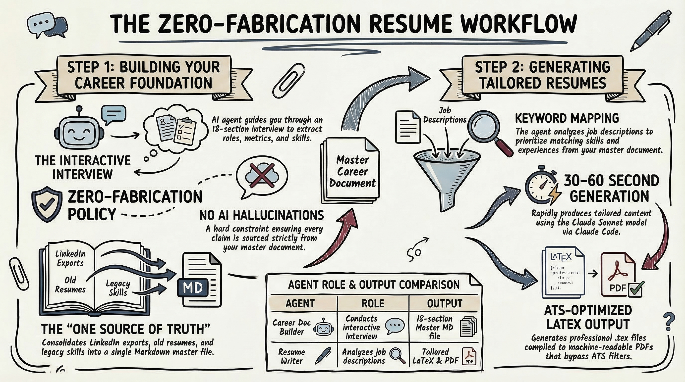
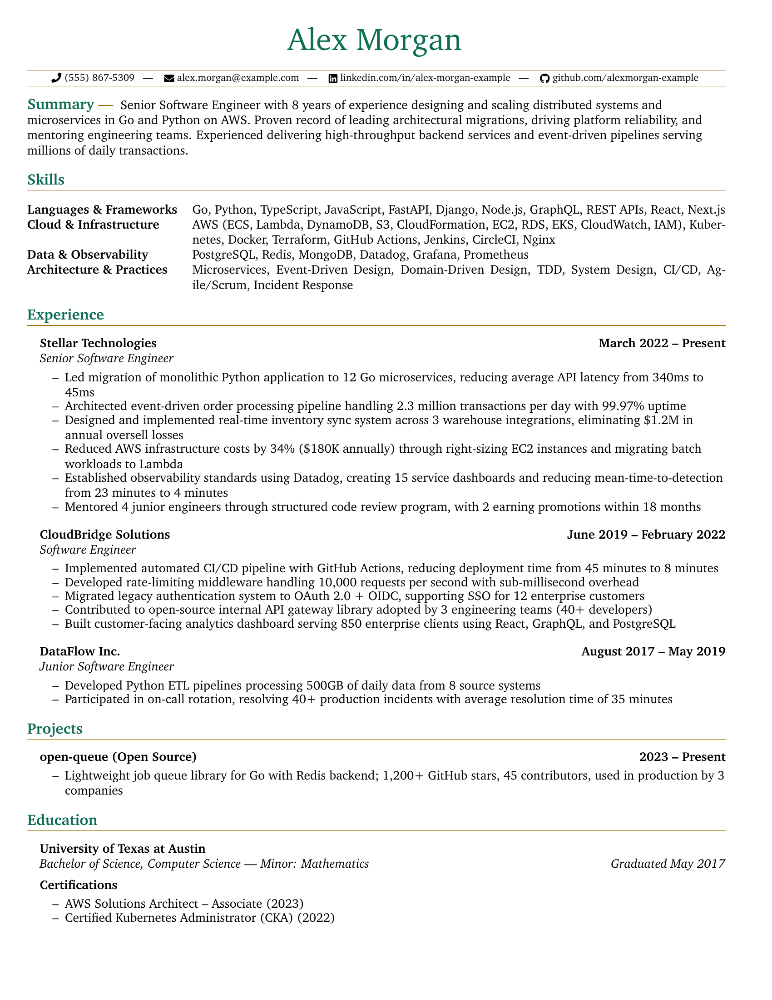
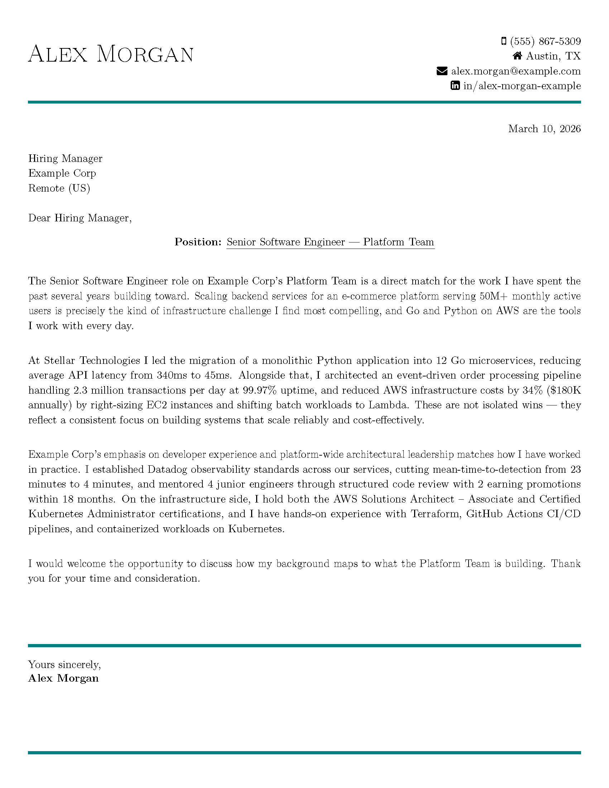

# ATS Resume Writer Agent for Claude Code

> v1.1.0

An AI-powered resume and cover letter generator built on [Claude Code](https://code.claude.com/docs). It creates ATS-optimized, LaTeX-formatted resumes tailored to specific job descriptions. It also includes a guided career document builder that helps you create the source material through an interactive interview.

**Zero fabrication policy:** The agent will never estimate metrics, suggest proxy numbers, or embellish your experience. If a quantified achievement isn't in your master document, it won't appear in the output. This is a hard constraint, not a suggestion.



## How It Works

The project has two agents that work together:

1. **Career Document Builder**: Guides you through an interactive interview to create a comprehensive Master Career Document. It can also ingest existing resumes, LinkedIn profile exports, or any career materials you already have as a starting point.
2. **Resume Writer**: Takes your Master Career Document and a job description, then produces a tailored LaTeX resume optimized for Applicant Tracking Systems. You run this each time you apply somewhere.

The typical flow:

1. Build your Master Career Document once (guided interview or manual)
2. Drop a job description file into the project
3. Tell Claude to generate a resume
4. The agent selects the most relevant content, maps keywords, and produces a polished PDF

### Sample Output

Here's what the agent produces from the included example data:

**Resume:**



**Cover Letter:**



## Prerequisites

### Claude Code

Install [Claude Code](https://code.claude.com/docs) (Anthropic's CLI tool). On macOS, Linux, or WSL:

```bash
curl -fsSL https://claude.ai/install.sh | bash
```

On Windows PowerShell:

```powershell
irm https://claude.ai/install.ps1 | iex
```

On Windows CMD, run `curl -fsSL https://claude.ai/install.cmd -o install.cmd && install.cmd && del install.cmd`. Homebrew (`brew install --cask claude-code`) and WinGet (`winget install Anthropic.ClaudeCode`) also work. Run `claude --version` afterward to confirm the install. See the [setup guide](https://code.claude.com/docs/en/setup) for other options.

You need a Claude Pro, Max, Team, or Enterprise plan, or an Anthropic Console (API) account. The free claude.ai plan does not include Claude Code. See [authentication](https://code.claude.com/docs/en/authentication) for details. Each resume generation typically uses the Sonnet model and takes 30-60 seconds. The career document builder interview takes longer depending on career complexity.

### LaTeX (for PDF compilation)

The agent outputs `.tex` files. To compile them to PDF, you need `pdflatex`.

**Ubuntu/Debian/WSL:**
```bash
sudo apt-get install texlive-latex-base texlive-fonts-recommended \
  texlive-fonts-extra texlive-latex-extra
```
This installs all required LaTeX packages. No additional package installation should be needed.

**macOS:**
```bash
brew install --cask mactex-no-gui
```
The full `mactex-no-gui` (~4GB) includes all required packages. The smaller `basictex` (~100MB) may be missing fonts and packages. If you use it, install missing packages with `tlmgr`:
```bash
sudo tlmgr update --self
sudo tlmgr install fontawesome5 fontawesome CormorantGaramond charter \
  ragged2e microtype lastpage bookmark tabularx enumitem titlesec fancyhdr
```

**Important:** The resume template uses `fontawesome5` and the cover letter template uses `fontawesome`. These are separate packages, and both must be installed for full functionality.

<details>
<summary>Troubleshooting LaTeX packages</summary>

To check if a specific package is installed:
```bash
kpsewhich fontawesome5.sty
```

If `pdflatex` fails with `File 'X.sty' not found`, install the missing package:
```bash
sudo tlmgr install <package-name>
```

If you don't have LaTeX installed and don't want to install it locally, you can still use the agent to generate the `.tex` files and compile them using [Overleaf](https://www.overleaf.com/) or another online LaTeX editor.
</details>

## Setup

1. **Clone this repository:**
   ```bash
   git clone https://github.com/NullSpace-BitCradle/ats-resume-agent.git
   cd ats-resume-agent
   ```

2. **Check dependencies** (optional but recommended):
   ```bash
   ./setup.sh
   ```
   This checks for Claude Code and LaTeX, and offers to install anything missing.

3. **Create your Master Career Document** (choose one):

   **Option A, guided interview (recommended):**
   ```
   Help me build my career document
   ```
   The `career-doc-builder` agent will walk you through an interactive interview to produce a comprehensive 18-section MCD. If you have existing resumes, LinkedIn exports, or other career materials, it can ingest those as a starting point.

   **Option B, manual:**
   ```bash
   cp examples/Master_Career_Document.md Master_Career_Document.md
   ```
   Edit `Master_Career_Document.md` with your real career data. See the example file for the expected format and available features like agent notes and legacy sections.

   **Note:** `Master_Career_Document.md` and `Job_Description-*.md` files in the project root are gitignored by default to prevent accidentally committing personal information. The example files in `examples/` are tracked normally.

4. **Start Claude Code in the project directory:**
   ```bash
   claude
   ```

   The agent definition in `.claude/agents/ats-resume-writer.md` is preconfigured, so you don't need to read or modify it to generate resumes.

## Usage

### Generate a Resume

Drop a job description file in the project root:

```bash
# Name it following the convention:
# Job_Description-[Company]-[Role].md
```

Then tell Claude:

```
Resume for the Example Corp file
```

or:

```
Resume and cover letter for the Example Corp file
```

The agent will:
1. Read your Master Career Document
2. Analyze the job description for keywords and requirements
3. Select the most relevant experience and skills
4. Generate a `.tex` file with ATS-optimized content
5. Compile it to PDF using `pdflatex`

Output files are saved to the `output/` directory.

### Review and Iterate

After generating a resume, you can ask for adjustments:

```
Make the summary more focused on leadership experience
```

```
Add the CloudBridge SSO migration project to the experience section
```

```
Can you review this resume? I'm not getting callbacks
```

### Verify Zero Fabrication

The zero-fabrication promise is checked in code, not just in the prompt. The validator reads a generated resume and your Master Career Document and fails if the resume contains anything the MCD does not back up:

- **Numbers:** every number, including spelled-out ones like "fifteen" or "12 million", must appear in the MCD. Percentages must match a percentage, money must match money in the same currency, and scaled values must match by value, so `2.3M`, `2.3 million`, and `2,300,000` are interchangeable, but a bare `3` does not back `3M`.
- **Dates:** each start and end date on a heading line. `Mar 2022`, `March 2022`, and `03/2022` count as the same date, and so do Present and Current.
- **Employers, titles, and degrees:** the text of every `\headingBf`, `\headingIt`, and `\heading` line, plus client names in `\itemTitle{Client: ...}`. When a heading has several parts (`Software Engineer, Staff`), they must appear together within a few lines of the MCD, not scattered across it. Common degree abbreviations (`B.S.`, `MBA`, `Ph.D.`) match the spelled-out degree.
- **Certifications:** each item, and any loose text, under a Certifications, Licenses, or Credentials heading or section. The name, issuer, and year must appear together in the MCD, so a real certification with a shifted year still fails.
- **Skills:** each item in the skills table, including rows that wrap across lines. An acronym passes when the MCD spells out the phrase it stands for (`TDD` for Test-Driven Development), and `AWS (EC2, Lambda)` in the MCD backs `AWS Lambda`.

These never count as a source: the "Legacy & Historical Platforms" section at any heading level (and titles like "Legacy Skills", "Deprecated Skills", or plain "Legacy"), Agent Notes, whether a quoted block or a bullet (a note saying "never list CISSP" is not evidence of CISSP), HTML comments, link targets, and the table of contents.

It also flags an unescaped `%` after a number (`34%` instead of `34\%`). LaTeX treats that `%` as the start of a comment, so the rest of the line silently disappears from the PDF even though `pdflatex` reports success.

If the resume has a skills section (Skills, Core Competencies, Technical Proficiencies, and similar names) or a certifications heading the validator cannot read, for example skills written as plain text instead of the template's table, it reports a `coverage` finding instead of passing. An unfamiliar layout fails loudly; it never passes silently.

The validator needs [Bun](https://bun.sh):

```bash
bun tools/validate.ts output/Resume-Your_Name-Company-Role.tex Master_Career_Document.md
```

It prints `PASS` and exits 0, or lists each unsupported claim with its line number and exits 1. Files that don't end in `.tex` are read as plain text (like the [plain-text export](#plain-text-export)), and only their numbers are checked.

**Cover letters** can name the company, the role, and facts from the job posting, so pass the job description as an extra source:

```bash
bun tools/validate.ts output/CoverLetter-Your_Name-Company-Role.tex Master_Career_Document.md Job_Description-Company-Role.md
```

A number that only the job description backs has to keep its context: `50M+ monthly active users` passes, but `mentored 5 engineers` does not pass just because the posting asks for "5+ years". A line that is nothing but a date (the letter's own date) is skipped; a date inside a sentence is still checked.

The validator refuses extra sources for a file with resume structure. Everything on a resume has to come from your own history, and a job posting's tech stack is exactly where padded skills come from.

What it cannot prove:

- **It matches values, not sentences.** If a real number, title, or date shows up attached to the wrong role, the validator will not notice.
- **Synonyms fail.** If the MCD says PostgreSQL and the resume says Postgres, it fails. The fix is to add the term to your MCD if it's true.
- **Prose isn't parsed for names.** An employer mentioned only in the summary paragraph isn't checked.

Treat a PASS as "nothing was invented," not "every sentence is accurate," and still read the output.

### Build or Update Your Career Document

The `career-doc-builder` agent guides you through creating a comprehensive Master Career Document via interactive interview:

```
Help me build my career document
```

It can also enrich an existing MCD:

```
Review my career document for gaps
```

```
Update my MCD with my new role
```

#### How the Career Document Builder Works

The agent runs a multi-phase interview that builds your career document section by section:

1. **Intake**: Feed it existing resumes, LinkedIn exports, or any career materials you have. It extracts roles, skills, metrics, and dates as a baseline. Starting from scratch is fine too.
2. **Identity & Positioning**: Establishes your target titles, value proposition, and writes 2-4 genuinely different professional summary angles.
3. **Skills Inventory**: Walks through skill categories relevant to your field, suggests gaps, and separates current skills from legacy ones.
4. **Work Experience**: The core of the interview. Goes role by role (most recent first), probing for metrics, suggesting common responsibilities you may have missed, and offering agent notes where context matters.
5. **Supporting Sections**: Education, certifications, publications, compliance expertise, volunteer work, and positioning guidance.
6. **Synthesis**: Revises your summaries with the full career context, curates a highlight reel of your strongest metrics, and delivers the final document.

The output is a single Markdown file with 18 structured sections. The interview typically takes 30-60 minutes depending on career complexity and how much existing material you provide. Once complete, you reuse this document every time you generate a resume, with no re-interviewing.

## Project Structure

```
ats-resume-agent/
|-- README.md                 # This file
|-- LICENSE                   # MIT (project) + CC-BY-4 (LaTeX template)
|-- CLAUDE.md                 # Instructions for Claude Code (you don't need to edit this)
|-- setup.sh                  # Dependency checker and installer
|-- package.json              # Bun scripts: validate, test
|-- .gitignore                # Excludes output files and personal documents
|-- .claude/
|   `-- agents/
|       |-- ats-resume-writer.md   # Resume/cover letter generation agent
|       `-- career-doc-builder.md  # Interactive career document builder agent
|-- images/                        # Screenshots for README
|-- tools/
|   |-- validate.ts                # Zero-fabrication validator
|   |-- latex.ts                   # Shared LaTeX parsing helpers
|   `-- validate.test.ts           # Validator tests (bun test)
|-- templates/
|   |-- resume-template.tex        # LaTeX resume template (CC-BY-4)
|   `-- cover-letter-template.tex  # LaTeX cover letter template
|-- examples/
|   |-- Master_Career_Document.md  # Example career doc with fake data
|   |-- Job_Description-Example_Corp-Senior_Engineer.md  # Example JD
|   `-- sample-output/
|       |-- Resume-Alex_Morgan-Example_Corp-Senior_Engineer.tex  # Example generated resume
|       |-- CoverLetter-Alex_Morgan-Example_Corp-Senior_Engineer.tex  # Example cover letter
|       |-- resume-preview.pdf     # Sample resume PDF
|       `-- cover-letter-preview.pdf  # Sample cover letter PDF
`-- output/                        # Generated resumes go here (gitignored)
```

## Master Career Document Format

The `career-doc-builder` agent produces a comprehensive 18-section MCD. You can also create one manually; the resume writer agent handles both formats. Key sections:

| Section | Purpose |
|---------|---------|
| **Contact Information** | Name, phone, email, LinkedIn, GitHub |
| **Professional Identity & Positioning** | Target titles and core value proposition |
| **Professional Summaries** | 2-4 different summary angles for different role types |
| **Hybrid Strengths** | Cross-domain strengths (section name adapts to your field) |
| **Core Competencies & Technical Skills** | Categorized skill lists with sub-categories |
| **Industries Supported** | Industries served across your career |
| **Work Experience** | Detailed roles with metrics and agent notes |
| **Education & Training** | Degrees, courses, certifications, lab environments |
| **Key Achievements & Metrics** | Curated highlight reel of strongest outcomes |
| **Leadership & Soft Skills** | Leadership style, values, professional attributes |
| **Notes for Resume Customization** | Positioning angles and metrics guidance by role type |
| **Legacy & Historical Platforms** | Outdated skills to exclude from resumes |

See `examples/Master_Career_Document.md` for the full 18-section structure with all available sections.

### Agent Notes

You can embed instructions for the agent directly in your career document:

```markdown
> **Agent Note:** This project was collaborative; do not attribute sole ownership.
```

The agent treats these as binding instructions and will respect them when generating content.

### Legacy Section

Any content under a "Legacy & Historical Platforms" heading is automatically excluded from all generated resumes. Use this for outdated skills you want to keep on record but never include in applications.

## Key Design Decisions

**LaTeX over Word/PDF:** LaTeX produces consistent, professional formatting and is ATS-compatible through Unicode glyph mapping (`\pdfgentounicode=1`). The PDF output is machine-readable by ATS systems despite custom fonts and styling.

**Keyword-first content selection:** The agent builds a keyword map from each job description and prioritizes matching content from your career document. Skills sections list job-description keywords first within each category.

**One source of truth:** All content comes from the Master Career Document. The agent never asks you for information during generation. It reads the files and produces output.

## Customization

### Adjusting the Visual Design

The LaTeX templates in `templates/` control the visual design:

- **Colors:** Edit the `\definecolor` lines in `templates/resume-template.tex`
  ```latex
  \definecolor{accentTitle}{HTML}{0e6e55}  % Name and section text
  \definecolor{accentText}{HTML}{0e6e55}   % Section headings
  \definecolor{accentLine}{HTML}{a16f0b}   % Horizontal rules
  ```
- **Fonts:** Uncomment one of the sans-serif options or keep the default serif (Garamond + Charter)
- **Margins:** Adjust the `\addtolength` values
- **Bullet style:** Change `\renewcommand\labelitemi{--}` to use a different bullet character

### Adjusting Content Strategy

The agent's content selection strategy, quality standards, and action verb lists are all defined in `.claude/agents/ats-resume-writer.md`. You can modify these to match your preferences. For example, changing the recency bias from 5-7 years to 10 years, or adjusting the page limit.

### Cover Letter Tone

Edit the cover letter standards section in the agent definition to adjust tone, structure, or length preferences.

### Model Settings

Both agents are configured to use the Sonnet model (`model: sonnet` in the agent frontmatter), which provides the best balance of speed, cost, and quality for this workflow. If you want to use a different model, edit the `model:` field in the agent definition files.

For the resume writer, Sonnet is recommended because it follows the template commands reliably and respects the hard constraints. For the career document builder, Sonnet also works well for the conversational interview format.

If you find the agents occasionally deviating from instructions (adding unsolicited content, ignoring agent notes), start a fresh session to avoid context pollution from previous conversations. Running plain `claude` always starts a new session (only `--continue` or `--resume` pick up an old one), and `/clear` wipes the context inside a session that is already open.

## License

This project is licensed under the [MIT License](LICENSE).

The LaTeX resume template (`templates/resume-template.tex`) is based on work by [Michael Lustfield](https://github.com/mtecknology) and is licensed under [CC-BY-4.0](https://creativecommons.org/licenses/by/4.0/legalcode.txt).

## Acknowledgments

- Resume LaTeX template by [Michael Lustfield](https://github.com/mtecknology) (CC-BY-4.0)
- Built for use with [Claude Code](https://code.claude.com/docs) by Anthropic
